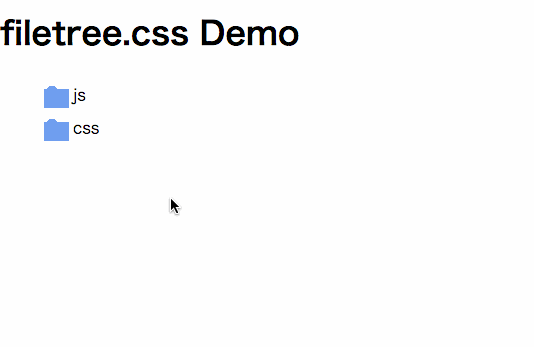

# filetree.css []()[]()
Implement function and style of file tree view using CSS only. **No JavaScript**.

[](https://nodei.co/npm/filetree-css/)



# Installation

in Cli

```
npm i filetree-css --save
```

in HTML

```
<link rel="stylesheet" href="./node_modules/filetree-css/filetree.css">
```


# Usage

```
<ul class="filetree">
  <li>
    <input type="checkbox" id="level1-1">
    <label for="level1-1">js</label>
    <ul>
      <li>my.js</li>
      <li>core.js</li>
    </ul>
  </li>
</ul>
```

# Contributing
Welcome :)

# License
MIT

